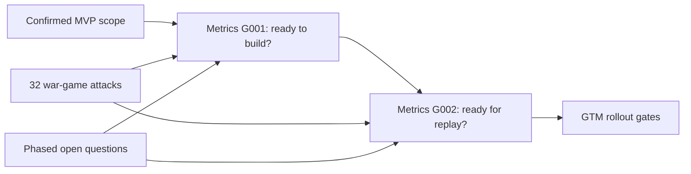

# 🧠 Agentic MVP (thought process)

# How We Reached the Agentic MVP: The first Tax Advisor platform shot
- Artifact ID: ADV-MORNING-001-MVP-P001
- Artifact type: reader-facing-decision-summary
- Version: 1.2
- Artifact completeness: complete
- Job ID: ADV-MORNING-001
- Canonical lifecycle stage: discovery
- Capability mode: mixed
- Requested transition: none. Stay in discovery and close the existing G001 inputs before build.
- Gate decision: hold
- Decision consequence: narrow
- Owner: Product
- Updated date: 2026-07-21
- Canonical brief: Open. No canonical JTBD dossier exists for this job yet.

## What this document is

This is the stand-alone story of the MVP decision and the later documentation audit.
It excludes hidden reasoning, prompts, raw tool output, secrets, and personal data.

## The result in one minute

The MVP is a greenfield daily home base for an internal Taxfix Advisor. A Tax Expert supports preparation.

The workbench connects to DATEV, task lists, and Taxfix systems. Email, general calendar integration, and client chat are outside the MVP. Client chat is an early follow-up.

The first deep job prepares one bookkeeping period for Advisor review. The system may plan, prepare, check, block, and resume. The Advisor keeps judgment and acceptance.

The tests and gates already exist. Metrics owns the build and replay gates. GTM owns recruitment and rollout gates. The war game does not create another gate system.

The current decision remains `hold → narrow`. We keep the product scope. We make the existing proof contract exact before build.

## The journey

## Where we started

The product direction had two parts.

The broad part was a full-day Advisor workbench. The deep part was one bookkeeping period.

The narrow case-tool idea was rejected. It would leave the Advisor running the day in other places. The workbench stayed in the MVP.

The user then corrected two bad assumptions.

First, SOTA is As-Is and market analysis. It can challenge the product. It does not set MVP scope.

Second, the MVP starts from scratch. Current code, tests, readers, and limits do not define what the product needs.

## What was already decided

The actor is clear. The internal Taxfix Advisor is primary. The Tax Expert supports preparation.

The source boundary is clear at product level. DATEV, task lists, and Taxfix systems are in. Email and a general calendar are out. Client chat is out for now.

The Kano Matrix is already the product package. It includes the workbench, source continuity, one deep bookkeeping mission, trust and human control, one AI front door, Taxfix client flow, agentic preparation, and Opportunity Radar.

The authority line is also clear. The system prepares. Humans decide. The MVP does not contact clients, sell, file, pay, sign, make professional judgments, or write to DATEV automatically.

Metrics already defines the quality language. It defines acceptance, false-ready, material correction, separate Advisor-day and bookkeeping scorecards, four early KPIs, hard guardrails, a gold case-pack structure, and mandatory scenarios.

Metrics also defines two product gates. G001 asks whether the contract is ready for build. G002 asks whether the built product is ready for synthetic replay.

GTM defines seven commercial stages. They run from internal discovery to open-market expansion. Claims widen only after evidence passes. Customer pricing stays Open until value and cost are proven.

## What the war game changed

The war game ran all 32 design challenges. Four rules survived. Thirteen challenges failed at the design level. Fifteen remain unknown because no proof exists yet.

The strongest threat is simple. The workbench may become a second place to maintain the same work. If source coverage is weak or stale, Advisors may use both Taxfix and old systems. Total work rises. Important work can still be missed.

This did not remove the workbench. It created a sharp proof need. We must show that the workbench removes more work than it creates.

The war game also exposed stale wording in other files. Vision, Metrics, GTM, and the context still contain old current-build, PDF-reader, GFR, chat, or calendar assumptions. Those lines need a later sync. They do not reopen the confirmed MVP.

## What is still open

Before G001 can approve build, we still need five concrete contracts:
- Exact DATEV, task-list, and Taxfix data, freshness, ownership, sync, and allowed effects.
- Exact synthetic case fields, exclusions, gold matches, open items, and readiness answer.
- Required document and evidence types, safe reading, source links, and blocked outcomes.
- Exact human-operated downstream handoff, receipt, correction, and unknown-result rule.
- Actual people and access for observation, gold approval, vetoes, and incidents.

The last item does not redefine the user. The user role is settled. Names are needed only so the existing gate can be run by real accountable people.

After the five-day baseline, but before replay or visible Opportunity Radar use, we need reviewer absence and overload rules, numeric thresholds, replay volume, the delayed-correction window, and the Radar relevance threshold.

Before real client data, we need the full provider, region, access, transfer, retention, deletion, tenant, and incident contract.

Before wider rollout, we need total-work, latency, cost, support, and review-load limits. Partner selection and market pricing remain with the existing GTM gates.

## Where we landed

We did not create a new requirements document. We updated the Agentic MVP.

We did not invent a third gate system. Metrics and GTM remain the owners.

We did not ask the user to define completed choices again. The open section separates true gaps from work that is already done.

We also separated due points. Real-data and scale questions are important. They do not block synthetic discovery unless the named gate says they do.

The correct decision is still `hold → narrow`. Narrow the proof contract. Keep the full-day workbench and the deep bookkeeping job.

## What happens next

No new definition is required now.

When the work resumes, start with the exact source and freshness contract. That is O020. It is the first defense against the duplicate-state kill shot.

Then continue through the open questions one by one. Do not reopen the primary user, MVP scope, Kano Matrix, greenfield boundary, or gate structure.
