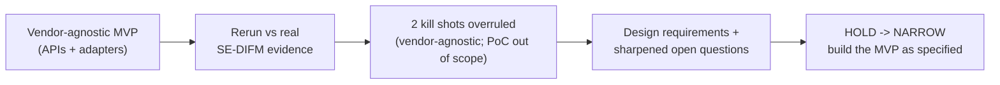

# 📄 Build decision (full document)

# Agentic MVP — Build Decision Record (Phase 1)
- Artifact ID: ADV-MORNING-001-DEC-A001
- Artifact type: build-decision-record
- Version: 1.2
- Artifact completeness: complete
- Job ID: ADV-MORNING-001
- Canonical lifecycle stage: discovery → build (gated)
- Capability mode: mixed (L2 Prepare)
- Gate decision: hold → narrow
- Decision consequence: narrow
- Owner: Product (Christine Kiefer), sponsor COO (Markus Berger de León)
- Updated date: 2026-07-21
- Purpose: One place that states the MVP we will build in Phase 1, the decisions we took, the war-game result that stress-tested them, and every open question — each with its rationale, so anyone can see WHY we chose this. Failing is acceptable; being unable to explain a choice is not.
- Scope boundary: This record works only from the WoW docs under `docs/product/wow/ADV-MORNING-001/` plus the company strategy (Notion/Drive). It does NOT treat the current `taxfix_harness` PoC codebase or its model-provider configuration as the plan (WAR-D013).

## 1. The decision in one page

**What we build in Phase 1:** a **vendor-agnostic, governed control-and-review surface for the internal Taxfix SE-DIFM operation**, built against **clean API abstractions** with a defined architecture. The bookkeeping engine, bank connection, and filing system (GFR.ai, FinAPI, DATEV/ELSTER today) are **reference integrations behind adapter interfaces** — swappable, not hard-wired. It has two layers:

1. **Control layer — the daily Advisor/Sachbearbeiter workbench.** Assembles what needs attention across the integrated systems (bookkeeping state, bank sync, client master data, filing dates), each behind its adapter, with source, owner, freshness, blocker, and next action visible per item.
2. **Execution layer — a governed review mission.** For one bookkeeping period it **assembles, verifies, source-links, and routes the bookkeeping engine's output** into an evidence-linked review package for the Steuerberater's Freigabe, and stops clearly when evidence, capability, or authority is missing. It **governs and verifies** the engine's output through its API; it does not re-implement bookkeeping computation.

**First case (frozen):** exactly one Buchungsprofil — a newly-founded German Einzelunternehmer/Freiberufler digital consultant, EÜR, Ist-Versteuerung, one bank account, ≤50–80 transactions/month, no cash, no employees, no e-commerce, not a Kleinunternehmer.

**First evaluation:** synthetic replay on that Buchungsprofil, against a pre-registered gold pack built to the real bank/engine schemas. Primary user is an internal Advisor; a Tax Expert supports preparation; the licensed Steuerberater (Suat Göydeniz / TaxVentures) signs.

**Gate: HOLD → NARROW** — the same gate as the v1.0 war game, for the vendor-agnostic MVP as specified. There are **no P0 blockers to the synthetic-replay build.** We hold to close a short list of design requirements and the existing G001 open questions. Three genuinely hard items (filing authority, a named security owner, reviewer failover) are real but are **controlled-live / real-data prerequisites** — due at their existing gates, not before the synthetic-replay build.

**Why this decision (the short version):** we reran the war game against the company's real, in-build SE-DIFM architecture. Two provisional "kill shots" it raised were **overruled by Product as design decisions, not defects**: (a) the greenfield-vs-vendor concern — we build **vendor-agnostic via APIs**, so naming GFR/FinAPI/DATEV in strategy is not lock-in; and (b) the current-PoC-build concern — the `taxfix_harness` codebase and its model config are **out of the decision matrix**. What the rerun genuinely gave us is a set of open questions now **sharpened by concrete company evidence** (the readiness rubric, the frozen case, the integration surface, the named team) and three well-bucketed prerequisites for going live. Nothing forces us to change the product shape.

## 2. The MVP we want to build (Phase 1 scope)

### In scope

| Layer | What it does | Boundary |
|---|---|---|
| Daily workbench (control) | Show clients, deadlines, blockers, waits, owners, sources, next actions across the integrated systems for the internal SE-DIFM operation. | Read/assemble only. Each integration sits behind an adapter; every source-derived field carries a poll-age/freshness stamp. |
| Governed review mission (execution) | For one period: pull the engine's booking proposals + bank transactions + OCR'd invoices via their adapters, verify and source-link them, run the readiness rubric, assemble the review package, route to Freigabe. | Consumes engine/bank output as **untrusted input**. Governs and verifies; does not re-compute. Stops on missing evidence/capability/authority. |
| Trust & control | Sources, checks, blockers, pause/cancel/return/take-over, durable audit package, four-eyes routing to the Steuerberater. | Human authority is absolute at the Freigabe. "Ready" is explicitly **not** "filed". |
| One front door, real agents | Tax Advisor Agent leads; DataJanitor Pro / FristenGuard / AdvisorLens / Document Review Agent visible behind it in one Plan and one Trace. | Each agent has a scope, capability limit, stop rule, and human gate. |

### Architecture principle (the vendor-agnostic contract)
- Every external system is reached through an **adapter interface**; no vendor type leaks into the core.
- The current reference integrations are GFR.ai (engine), FinAPI (bank), DATEV/ELSTER (filing). Their **real access constraints** (e.g. DATEV's partner-gated API) are treated as **integration-sequencing items**, not product blockers.
- The handoff is **format-neutral** at the export boundary (DATEV-CSV/DAT), so the filing route is not hard-coupled to one vendor.

### Explicitly NOT in Phase 1
- No re-implementation of bookkeeping computation the engine already performs.
- No DATEV write automation; the downstream handoff is human-operated and recorded.
- No client chat or AI-assisted client-message loop (deferred).
- No real client data (synthetic replay first).
- No Kleinunternehmer §19, e-commerce, Kapitalgesellschaft, employees/payroll, cash business, or Bilanzierungspflicht cases.
- No structured e-invoice (ZUGFeRD/XRechnung) yet — parse-or-stop, flagged as a near-term gap.
- No Opportunity Radar beyond a single shadow-only overdue-receivables card.

## 3. The decisions we took, and why

| Decision | What we decided | Why (rationale we can defend) |
|---|---|---|
| **DEC-01** (WAR-D014) | The MVP is **vendor-agnostic**, built against clean API abstractions. GFR/FinAPI/DATEV are reference integrations behind adapter interfaces, not a lock-in. The greenfield-vs-brownfield framing is rejected. | Naming a vendor in strategy is not the same as coupling to it. A clean adapter architecture lets us integrate the committed systems now and swap them later, and it keeps the vendor-neutral handoff (MET-D009) as an achievable design intent rather than a contradiction. |
| **DEC-02** (WAR-D011) | The execution layer **governs and verifies the bookkeeping engine's output through its API** and assembles an evidence-linked review package; it does not re-implement bookkeeping computation. | The engine already does OCR / booking / VAT / reconciliation / §14 validation. Re-deriving that adds a hallucination surface and no verifiable upside. The honest, valuable job is governance, verification, source-linking, and routing. |
| **DEC-03** (WAR-D013) | The current PoC build (`taxfix_harness` codebase and its model-provider config) is **out of the decision matrix**. | We build the MVP from the WoW docs and company strategy, not from the current prototype. |
| **DEC-04** | Bookkeeping dates and work state come from the **integrated systems via their adapters**; DATEV is integrated through its **sanctioned API/partner route** when access is granted, with dates sourced from other systems until then. | DATEV access is partner-gated (AGB 2.6, no OAuth client_credentials, 2FA). This is an integration-sequencing reality, handled by the adapter and a dated onboarding item. |
| **DEC-05** | The first case is the **one frozen Buchungsprofil** (§2), with hard exclusions enforced by a **fail-closed scope gate** upstream of preparation. | Notion fixes exactly one pilot profile and an explicit exclusion list; without an upstream gate, out-of-scope work can silently pass and certify a wrong result (F030). |
| **DEC-06** | First evaluation is **synthetic replay** on a **pre-registered gold pack** built to the real bank/engine schemas, with the readiness rubric (Ausgangsrechnung NOGO; Eingangsrechnung partial; recurring rent = contract suffices; match >85%). | Replay proves honesty and safety without real client data. The rubric already exists in Notion; we encode it verbatim. |
| **DEC-07** | Human authority is absolute at the **Steuerberater Freigabe**; "ready" ≠ "filed"; autonomy stays **L2-Prepare** (no auto-submit). | Four-eyes Freigabe is legally mandatory; the Steuerberater carries full StBerG liability. |
| **DEC-08** | Gate stays **hold → narrow**. There are **no P0 blockers to the synthetic-replay build**; we hold to close the design requirements and the existing G001 open questions. | The rerun's provisional P0s were overruled (DEC-01, DEC-03) or are controlled-live/real-data prerequisites (§6). |
| **DEC-09** | Metrics are **bound to reality**: ≥1 gate KPI tied to a tracked live metric (FL/rework or prep-time); match denominator pinned to all in-period transactions; cost-per-case baseline established and CP1 gated on margin; a post-submission error-detection-latency KPI bounded to the §347 AO 1-month Einspruchsfrist. | G002 KPIs currently map to no live North Star, and the live comparable product already runs FL 23.4% vs a <10% target. |
| **DEC-10** | Client chat, AI-message loop, Opportunity Radar (beyond one shadow card), e-invoice parsing, DATEV write automation, and real client data are **deferred to later, separately-gated phases**. | These add scope, authority, or data exposure the first proof does not need. |

## 4. The war-game result (what stress-tested these decisions)

We reran the full war game (v2.1) against the real SE-DIFM architecture: re-adjudicated all 32 prior scenarios, ran a fresh 10-front attack, and adversarially refuted every kill-shot claim.

- **Prior 32 scenarios (v2.1):** 2 survived, 22 unknown, 8 failed.
- **Two provisional kill shots overruled by Product:** the greenfield-vs-vendor concern (→ DEC-01) and the illegal-LLM-egress concern (→ DEC-03).
- **Three real findings reclassified to their correct gates:** single-Steuerberater failover (F022 → controlled-live), filing authority (F024 → controlled-live), named security owner (F025 → real-data).
- **Design requirements before build→replay:** govern-don't-duplicate (F026), freshness/fail-closed (F029), scope gate (F030), recovery path (F031), real evidence + e-invoice + injection quarantine (F032), metrics binding (F033).
- **One claim refuted outright:** the "execution job is unbuildable under a MET-D009 ∧ MET-D010 double bind" — the constraints are orthogonal.
- **Verdict:** no MVP kill shot stands. **HOLD → NARROW**, for the vendor-agnostic MVP as specified.

## 5. Open questions — grouped by gate, with what Notion now answers

### Close before build → replay (MET-G001) — design requirements + existing inputs

| Open | Question | Status after Notion + rerun |
|---|---|---|
| O020 / O021 | Connected-source contract (via adapters); frozen case schema, rubric, gold pack. | **Substantially answered** (integration surface; Buchungsprofil; readiness rubric; match >85%). Residue: exact ~60-of-1200 SKR03/04 account list + SKR choice; enum values (OQ-1); prior-bookkeeping takeover. |
| O022 (F032) | Required evidence types + fields + safe/blocked result. | **Answered** (bank/invoice/ledger/debtor schemas). Add: EN-16931 parse-or-stop; quarantine OCR-derived text. |
| O024 | Named sponsor, PM, advisors, gate participants. | **Answered:** Markus (COO), Christine (PM), Claire (GTM), Massimo (Eng), Carolin (Ops), Ozan (Dashboard), Suat (StB), Carlo Piltz (DPO). Security owner deferred to O012. |
| F029, F030 | Freshness/fail-closed; fail-closed scope gate. | **Design requirements** derived from the rerun; specify and build. |

### Due before replay or visible use

| Open | Question | Status |
|---|---|---|
| O025 / O011 (F022) | Reviewer absent/overloaded/late/rubber-stamping; failover for the single Steuerberater. | Partly answered (TA-Dashboard PRD rules) — but no absence-failover for Freigabe. Controlled-live/scale prerequisite. |
| O026 (F033) | Numeric thresholds + minimum replay volume. | **Open; Notion cannot answer.** Pre-register internally before results are seen; anchor on live baselines (FL 23.4%→target, prep 5 min, match >85%). |
| O028 | Opportunity Radar service catalog + threshold. | Catalog exists; **all 4 KPIs "not tracked", no numeric threshold** — deferred to Q3'26 shadow scoping. |
| O029 (F033) | Net-work-removal limits (effort/cost/latency/review-load). | **Open.** Cost-per-case baseline not established; establish it and gate CP1 on margin. |

### Due before controlled live / real client data

| Open | Question | Status |
|---|---|---|
| O013 / O023 (F024) | Filing authority (Untervollmacht §80 AO + LAPIS Unterberaternummer); ELSTER-confirmation reconciliation. | Real regulatory prerequisite for the filing leg. The MVP stops at prepare/review, so it does not block the synthetic-replay build. |
| O019 / O012 (F025) | Retention, deletion, EU-LLM provider allowlist, permissions, named Security + Privacy owners. | Retention framework + EU-LLM policy exist; DPO named. **No security owner; no permission-versioning; AI-log retention "to be defined".** Before real data. |

## 6. What blocks what (the honest gate picture)
- **Synthetic-replay MVP build:** blocked only by the design requirements (F026, F029–F033) and the existing G001 inputs (O020, O021, O024, O026). No P0.
- **Controlled live / real client data:** additionally requires the reviewer failover (F022/O011), the filing authority (F024/O013), the named security owner + provider allowlist + AVV/DPAs (F025/O012/O019), and the DATEV partner onboarding (F028).

## 7. The design requirements in plain words — build now vs iterate

| ID | Plain-language name | What it means | Why it matters | Build now or iterate? |
|---|---|---|---|---|
| **F026** | Govern the engine, don't rebuild it | The bookkeeping engine already does OCR, bookings, VAT, and matching. Our layer checks and packages its output; it does not redo the bookkeeping. | Rebuilding it adds a place for the AI to invent things, with no upside. | **Shape now** — it is the core architecture. Retrofitting later is a rewrite. |
| **F029** | Know how fresh the data is, fail safe when stale | Every fact carries a "last checked at" stamp. If it is too old, the system refuses to say "ready" instead of guessing. | The worst failure is calling a period "done" on yesterday's bank data. | **Shape now (minimal)** — fail-closed must be the default from the first run. |
| **F032** | Read documents, don't take orders from them | Accept the real formats (PDF/JPEG invoices, bank JSON) or stop cleanly; and never let text inside a document act as an instruction to the AI. | A malicious or odd invoice must not be able to say "ignore the rules" and be obeyed. | **Shape now (minimal)** — a security boundary is cheap to design in, expensive to bolt on later. |
| **F030** | A strict "does this case belong here?" gate | Before any work starts, check the case fits the one allowed profile; anything outside → stop, don't process. | Without it, an out-of-scope case can quietly run and produce a confident but wrong result. | **Iterate** — start with a simple allow-list check, expand case by case. |
| **F031** | A place for blocked cases to go | The most common stop ("a required invoice is missing") normally needs client contact, which the MVP does not do — so blocked cases route to an owned human queue with a turnaround. | Otherwise blocked cases pile up with no way to unblock. | **Iterate** — a basic "needs a human" tray is enough to start; refine later. |
| **F033** | Grade against a real benchmark | The pass/fail numbers connect to a live yardstick (the current product runs ~23% rework), and the match rate counts all transactions so it cannot be gamed by skipping hard ones. | Otherwise we could "pass" a product that is actually worse than today. | **Iterate** — thresholds cannot be finalized until the five-day baseline exists; they are meant to be set later, before replay results (O026). |

**The rule of thumb:** treat the three "shape now" items (F026, F029, F032) as architectural defaults installed from the first line of code. The other three (F030, F031, F033) can start rough and sharpen as you learn.

## 8. Ready-to-build checklist for Phase 1

- [ ] Adapter interfaces for engine / bank / filing; no vendor type in the core (DEC-01).
- [ ] Fail-closed scope gate upstream of preparation (KU §19, e-commerce, Rechtsform, turnover/profit, cash, mixed account). (F030)
- [ ] Poll-age/freshness stamp on every source-derived field; fail closed (suppress filing-ready) past a max-staleness threshold. (F029)
- [ ] Consume engine/bank facts as **untrusted input**; quarantine document/OCR strings from the instruction channel; injection red-team in the gate. (F032)
- [ ] Readiness rubric encoded verbatim (Ausgangsrechnung NOGO; Eingangsrechnung partial; recurring rent = contract; match >85%); durable evidence-linked review package to Freigabe. (DEC-06)
- [ ] Replay gold pack on real bank/engine schemas; excluded profiles present only as expected-REFUSE fixtures. (DEC-05, F030)
- [ ] Owned human-ops queue (with SLA) for blocked cases that would otherwise need the deferred client channel; document un-unblockable case types. (F031)
- [ ] Metrics bound to reality (≥1 live-anchored gate KPI; pinned match denominator; cost-per-case baseline; downstream error-latency KPI). (DEC-09, F033)
- [ ] Canonical JTBD dossier created so one place owns lifecycle status, gate decisions, and owners. (Todo item 10.)

## 9. Why "failing is OK" here

This record chooses a vendor-agnostic, provable first phase over both a hard-coupled build and an over-broad one. Two named risks may still prove us wrong, and that is acceptable because we can explain the bet:

- **The governed review surface may add too little value over the engine alone.** If synthetic replay shows the verification + audit + routing layer does not measurably improve trusted completion or reduce Advisor effort, we narrow further or stop — that is what the gate is for (DEC-02, WAR-H004).
- **The single-Steuerberater launch model may not scale past the 50–100-client ceiling.** If it cannot, the manual-handoff phase is a learning vehicle only, and the scaled product waits for the Phase-2 automation bridge — a dated, separately-gated decision, not a silent assumption (F022, DEC-08).

Either outcome is a defensible, communicated decision rather than a surprise. That is the point of this record.

- Next owner/action: Product closes the design requirements (F026, F029–F033) and the G001 open questions to reach build→replay; the controlled-live prerequisites (F022, F024, F025, F028) close at their gates in parallel.
