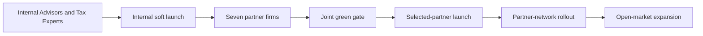

# How We Reached the GTM Scenario — Tax Advisor Platform

- Artifact ID: ADV-MORNING-001-GTM-P001
- Artifact type: reader-facing-decision-summary
- Version: 1.0
- Artifact completeness: complete
- Job ID: ADV-MORNING-001
- Canonical lifecycle stage: discovery
- Capability mode: mixed
- Requested transition: No product lifecycle or capability transition. Begin internal Taxfix SE-DIFM discovery and design-partner recruitment.
- Gate decision: go
- Decision consequence: continue
- Owner: Product / GTM
- Updated date: 2026-07-21
- Canonical brief: Open — no canonical JTBD dossier exists for this job
- Input artifacts: ADV-MORNING-001-SOTA-A001 v1.2; ADV-MORNING-001-MVP-A001 v1.0; ADV-MORNING-001-VIS-A001 v0.14; ADV-MORNING-001-MET-A001 v1.1; TAX-PLATFORM-CONTEXT-A001 v0.1
- Result artifact: [GTM scenario](gtm_scenario.md)
- Source transcript: [sanitized transcript](gtm_agent_transcript.md)

## What this document is

This is the short story of how we reached the GTM scenario.

It summarizes the inputs, corrections, choices, result, and remaining work. It is not hidden model
reasoning and excludes private or unsafe material.

## The result in one minute

We start with internal Taxfix SE-DIFM Advisors and Tax Experts, not the open market. The first offer
tests the complete Kano package. Internal recruitment may begin now. Product build, real-client
use, and customer pricing remain closed. After internal proof, we move through an internal soft
launch, seven partner firms, a joint green gate, selected partners, the partner network, and only
then the open market. Claims widen when evidence passes, not when a date arrives.

## The journey

## Where we started

The product direction was strong. The proof was not.

The WoW work had fixed the north star: a Codex-like Tax Advisor Platform. The first shot combines
a daily Advisor control layer with one deep bookkeeping period and the complete Kano package.

But the job remains in discovery with `hold` → `narrow`. We have no five-day baseline, replay
result, live adoption proof, product-specific willingness to pay, ROI, or controlled-live approval.
Market sources support the problem. They do not prove this product works or will sell.

An external launch would turn a roadmap into a claim. The current GTM is a learning route.

## What changed and why

1. **We chose the internal team first.** Advisors and Tax Experts carry the target work and give us
   the fastest path to direct evidence.

2. **We kept the complete product test.** The breadth sits in the daily control layer. Deep
   execution stays with one bookkeeping job. Every Kano item is test scope, not current proof.

3. **We separated learning from launch.** We can recruit, observe, co-design, prepare the baseline,
   and set up synthetic tests. This does not approve build, live use, or pricing.

4. **We fixed the sponsor.** The Advice SE-DIFM business or operations owner sponsors the work.
   Product runs GTM. Control owners keep stop rights. Actual names still need recording.

5. **We made expansion deliberate.** Internal proof is not partner proof. Partner proof is not
   automatically open-market proof. Each cohort gets its own gate.

6. **We replaced timed claims with earned claims.** Each stage unlocks wording only for its proven
   cohort and scope. Confidence cannot overrule failed quality or safety proof.

## The choices that shaped the result

| Choice | Real options | Why we chose this | What we gave up |
| --- | --- | --- | --- |
| First audience | Internal team, external firms, or both | Internal users provide direct workflow access and match the roadmap | Earlier external-market learning |
| Offer scope | Bookkeeping only or complete Kano package | The workbench and deep mission were already confirmed as one first shot | A smaller and easier test |
| Current commercial move | Launch, paid pilot, or design-partner discovery | No outcome or buyer proof exists yet | Early revenue claims |
| Pricing | Set a price now or measure value first | We need effort, cost, capacity, and contribution proof | A near-term price point |
| Claim timing | Calendar date or evidence gate | Dates do not prove quality, safety, adoption, or value | Simple launch-date storytelling |
| Expansion | Market first or staged transfer | Each new cohort must prove transfer and operating fit | Maximum launch speed |

## Where we landed

The current offer is an internal design-partner program for the complete first platform experience.
One workbench should run the day, keep source-system continuity, prepare one eligible bookkeeping
period, show blockers, support missing-evidence follow-up, link communication, and surface one
evidence-backed client need. The Advisor keeps judgment and consequential actions.

Recruitment starts through internal nomination. Participants also support the five-day baseline.
There is no customer price in discovery. We first measure effort, trusted completion, coverage,
cost, capacity, and later net revenue per active Advisor.

During discovery, we say we are testing. Internal, partner-test, selected-partner, network, and
general-market availability each require their own passed gate.

Some boundaries remain. The system does not automatically contact clients, sell, file, pay, sign,
or make professional judgments. We do not say “every document,” “fully autonomous,” or
“tax-correct.” We name the exact supported scope and keep human accountability visible.

## What is still open

- The actual internal sponsor, Advisors, Tax Experts, and control owners must be named.
- The five-day baseline, exact case contract, gold pack, thresholds, and replay volume must close
  before product Gate G001 can pass.
- Low-document-volume freelancers and digital consultants remain an initial cohort assumption.
- Before Stage 3, we must name the seven partner firms and define a useful mix, evidence volume,
  partner thresholds, data path, onboarding, support, and commercial terms.
- Pricing remains open until operating and buyer evidence exists.
- The canonical JTBD dossier is still missing.

## What happens next

Product and GTM should name the internal sponsor and cohort. Product, Domain, Advisors, and the
control owners should then prepare the five-day baseline and close the G001 proof contract. The
next useful conversation is not market launch planning. It is the internal recruitment and
evidence plan that makes Stage 1 real.
