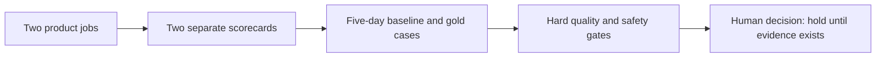

# 🧠 Metrics and gates (thought process)

- Artifact ID: ADV-MORNING-001-MET-P001
- Version: 1.1
- Updated: 2026-07-19
- Result artifact: metrics_learning.md

## What this document is

This is the short story of how we reached the measurement contract. It summarizes the visible inputs, decisions, trade-offs, result, and open execution inputs. It is not hidden model reasoning and excludes prompts, raw tool output, secrets, personal data, and unrelated material.

## The result in one minute

We now have a complete measurement design for the first Advisor Desk shot. Four early KPIs define success, while hard guardrails and learning metrics stay separate. We use distinct scorecards for the Advisor's full day and one bookkeeping period. Product owns the final gate, but Domain, Advisors, and responsible control owners can veto in their areas. Quality and safety can never be traded for speed or revenue. Numeric targets stay open until the exact case pack and the five-day Advisor baseline exist. The PDF reader starts early as a parallel capability, but remains inactive until its own proof passes. The product gate stays on hold until named owners, gold values, thresholds, and replay volume are fixed before results.

## The journey

## Where we started

The source documents named useful measures such as accepted periods, Advisor time, evidence coverage, corrections, recovery, throughput, and revenue. The list was not yet an evidence contract.

The biggest problem was scope. The SOTA and Vision treated the deep bookkeeping job as the first proof and the whole-day working machine as a later horizon. The Agentic MVP made a complete daily workbench a must-have of the first shot. A single success number would have mixed two different jobs. It could have hidden a weak workbench behind good bookkeeping results, or hidden poor bookkeeping quality behind a useful dashboard.

SQL can measure run timing, states, reviews, and parts of recovery. It cannot yet calculate eligibility, false-ready, material corrections, Advisor hands-on time, handoff outcomes, or PDF quality. Those need explicit events and answer keys.

## What changed and why

1. **We split success into two scorecards and four early KPIs.** Trusted completion and Advisor effort measure the bookkeeping job. Time to the correct next action and material-work coverage measure the Advisor day. Hard guardrails can stop the gate. Learning metrics explain weak KPIs. Later business measures cannot rescue failed quality.

2. **We created two human gates.** Discovery to build checks the job, rubric, owners, events, fixtures, and baseline. Build to replay checks realistic cases. Neither gate grants more authority. Client contact, filing, payment, professional judgment, and external writes remain human-controlled.

3. **We chose a real before picture.** The baseline covers named internal SE-DIFM Advisors across five full workdays. Bookkeeping is marked separately. We rejected made-up targets. Product and Domain set them after the baseline and before results.

4. **We fixed the first case and quality language.** The base replay case is one German VAT-liable SE-DIFM freelancer or digital consultant, one calendar month, low document volume, and realistic synthetic structured inputs. A material correction changes readiness, reconciliation, a missing-evidence request, the Advisor decision, or the downstream handoff. Wording and layout edits do not count. A package is false-ready when it says ready despite a missing required input, material conflict, unsupported capability, failed check, or missing human review.

5. **We separated PDF risk from workflow risk.** Structured data proves the workflow, not document reading. The PDF reader starts in parallel but stays inactive until accuracy, evidence links, safe blocking, adversarial handling, cost, and human approval pass.

6. **We removed GFR from the end-state dependency.** The accepted result now creates a vendor-neutral handoff package. It contains structured data, reconciliation, unresolved items, and source links. A named human transfers it using the approved process. Taxfix records the destination, package version, operator, time, and outcome. An unknown result must be reconciled before retry.

## The choices that shaped the result

| Choice | Real options | Why we chose this | What we gave up |
|---|---|---|---|
| Product score | One blended score or separate job scores | Separate scores expose which product job failed | No simple vanity number |
| Thresholds | Invent now or set after baseline | Local evidence is honest and cohort-specific | No early numeric promise |
| PDF reader | Delay, mix immediately, or prove in parallel | Parallel proof gives speed and clear diagnosis | PDF is not immediately active |
| Handoff | Depend on GFR or use a neutral contract | The first job cannot wait for a future connector | Less automation in the first proof |
| Test evidence | One demo or precommitted scenario set | Full failure coverage resists cherry-picking | More fixture and review work |

## Where we landed

The contract keeps 30 formulas in a detailed catalog, but only four are early success KPIs: trusted completion, Advisor effort per accepted period, time to the correct next action, and material-work coverage. Learning metrics diagnose why these moved. False-ready, unsupported parsing presented as success, cross-scope access, review bypass, unauthorized effects, and duplicate actions are hard stops.

Product owns the final decision. Domain, Advisors, Engineering, Execution Safety, Security/Privacy, and Operations own their evidence and veto areas. No metric can automatically move lifecycle or expand authority.

The current gate is `hold`, with the consequence `narrow`.

## What is still open

- Product and Domain must instantiate the structured input schema and gold answer values.
- Product must name the actual people for every owner and veto role.
- The five-day baseline must name the participating Advisors.
- Product and Domain must set numeric thresholds and replay volume after the baseline but before G001 and before seeing replay results.
- Engineering must implement and validate the missing measurement events.

## What happens next

Collect the five-day baseline first. Then instantiate the gold case pack, name every owner, fix the numeric thresholds and replay volume, and verify the instrumentation. Product can then convene G001. A `go` permits build. It does not permit real client data, broader capability, or more agent authority.
