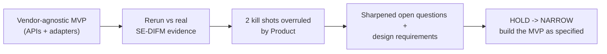

# How We Reached the War-Game Decision — Advisor Morning and First Bookkeeping Period

- Artifact ID: ADV-MORNING-001-WAR-P001
- Artifact type: reader-facing-decision-summary
- Version: 2.1
- Artifact completeness: complete
- Job ID: ADV-MORNING-001
- War-game mode: design-simulation (rerun with company evidence; corrected by Product)
- Canonical lifecycle stage: discovery
- Capability mode: mixed
- Evaluation mode: design simulation; v2.0 re-adjudicated against the real SE-DIFM evidence; v2.1 records Product's decisions
- Requested transition: discovery to build under ADV-MORNING-001-MET-G001
- Gate decision: hold
- Decision consequence: narrow
- Owner: Product / Execution Safety; named DRI Open
- Updated date: 2026-07-21
- Canonical brief: Open — [JTBD portfolio](../../jtbd/README.md)
- Result artifact: [war-game report](war_game.md)
- Source transcript: [sanitized transcript](war_game_agent_transcript.md)
- Companion decision record: [agentic_mvp_decision.md](agentic_mvp_decision.md)

## What this document is

This is the stand-alone story of the v2.x war-game rerun: why we ran it again, what the real company evidence sharpened, which provisional findings Product overruled, and what we decided. It excludes hidden reasoning, prompts, raw tool output, secrets, and personal data.

## The result in one minute

We first ran this war game as a greenfield thought experiment and said "hold, then narrow." Then we pulled the real internal SE-DIFM strategy from Notion — a numbered requirements spec, a committed integration surface (a bookkeeping engine, a bank connector, DATEV/ELSTER), a named team, and a single tax advisor who signs the filings by hand at launch. We reran the same attacks against that reality. The rerun threw two dramatic kill shots — "you're really building on a specific vendor stack, not greenfield" and "the model config sends data to a non-EU provider." Product overruled both, correctly: the MVP is **vendor-agnostic**, built against clean APIs, so naming a vendor in strategy is not lock-in; and the current prototype's model config is **out of the decision matrix** — we build from the docs, not the prototype. Once those two are set aside, the rerun's real value is plain: it confirmed the MVP's structure and sharpened its open questions with concrete evidence, and it named three genuine prerequisites for going live (filing authority, a security owner, reviewer failover) that were always meant to sit at later gates. No kill shot survives. The decision stays **hold → narrow**, and we build the MVP as specified. The full plan is in the [decision record](agentic_mvp_decision.md).

## The journey

## Where we started

The v1.0 war game tested the MVP as a greenfield design against itself. It kept the full-day workbench and the one deep bookkeeping job in scope and left one kill shot open: a full-day desk that becomes a second place to maintain work. That was plausible but unproven, so we held.

What we did not have then was the company's real plan. We have it now: the SE-DIFM product is being specified against a bookkeeping engine (GFR.ai), a bank connector (FinAPI), and DATEV/ELSTER, with a named team and a licensed tax advisor, Suat Göydeniz of TaxVentures, signing the filings by hand for the first 50 to 100 clients. The user asked us to bring that evidence in — so we did.

## What changed and why

1. **The rerun over-read the vendor question — and Product corrected it.** Because the strategy names GFR/FinAPI/DATEV, the rerun argued the MVP was "really" a brownfield product locked to those vendors, contradicting its greenfield framing. Product ruled that this is a false choice: we build **vendor-agnostic**, against adapter interfaces, and integrate the committed systems behind them. Naming a vendor is not coupling to it. That dissolves the "two products under one name" kill shot and keeps the vendor-neutral handoff as an achievable design intent, not a contradiction.

2. **The rerun judged the prototype — and Product ruled it out of scope.** One finding said the current model config routes data to a non-EU provider. True of the prototype, irrelevant to the plan: we build the MVP from the WoW docs and company strategy, not from the `taxfix_harness` codebase. This is the same boundary the v1.0 war game already drew around "current build." The finding is retracted; the underlying EU-model requirement lives where it belongs — a prerequisite before real client data.

3. **The workbench staleness concern became a design requirement, not a kill shot.** Any system that reads another system through an API can show stale data. The answer is not to abandon the workbench; it is to stamp every field with its freshness and fail closed past a threshold. That is engineering, and it is engine-agnostic.

4. **The "the engine already does the bookkeeping" point survived — as a scoping principle.** The bookkeeping engine does the OCR, the bookings, the VAT, the reconciliation. So the MVP's execution layer should **govern and verify** that output and assemble the review package — not re-implement the computation and add a hallucination surface. That is a good architecture decision, and it holds whichever engine sits behind the adapter.

5. **Three findings are real, but they belong to later gates.** A single tax advisor with no backup is a real scaling risk; filing needs a sub-power-of-attorney and an advisor number that are not yet in place; and no one yet owns security or the breach clock. None of these blocks a synthetic-replay build — they are prerequisites for controlled live and real client data, which the MVP already keeps behind separate gates. Naming them concretely is the rerun's most useful output.

6. **We hold and narrow — same as v1.0.** With the two kill shots overruled and the hard items placed at their correct gates, there is nothing forcing a change to the product shape. We hold to close a short list of design requirements and the open questions we already knew about, then build the MVP as specified.

## The choices that shaped the result

| Choice | Real options | Why we chose this | What we gave up |
| --- | --- | --- | --- |
| Vendor stance | Hard-couple to the named systems, or build vendor-agnostic behind adapters | Adapters let us integrate now and swap later; no lock-in | Some short-term simplicity of a direct integration |
| The prototype | Judge the MVP by the current code, or exclude it | We build from the docs, not the prototype | The false comfort of "the code already does X/Y" |
| Execution layer | Re-implement bookkeeping, or govern and verify the engine's output | Governance adds value without duplicating or hallucinating | A flashier "the agent does the bookkeeping" story |
| The hard findings | Treat as build blockers, or place at their real gates | They are controlled-live/real-data prerequisites, not replay blockers | The drama of a "does not survive" headline |
| Gate | Go, hold, or kill | Design requirements + open questions remain; the shape is sound | Starting build before the small list closes |

## Where we landed

Two scenarios survived on their merits: mandatory four-eyes sign-off is a legal requirement no model dissolves, and the prototype is out of scope. Most scenarios are documented but unproven. Eight failed, and every one maps to a known open question — claim discipline, cost/metrics binding, reviewer capacity at scale, and one controlled-live integration prerequisite.

The decision is hold → narrow, for the vendor-agnostic MVP as specified. We keep the two-layer product shape, human authority, and the vendor-neutral handoff (now realized through adapters). We build against clean APIs, govern the engine rather than duplicating it, and prove the whole thing on synthetic data first. The build-ready Phase-1 scope, the ten decisions with their rationale, and the "failing is OK" bets are in the [decision record](agentic_mvp_decision.md).

## What is still open

- Design requirements to close before build→replay: the adapter interfaces, the fail-closed scope gate, freshness/fail-closed handling, document-text quarantine plus e-invoice parse-or-stop, the recovery path for blocked cases, and metrics bound to a live baseline.
- Existing G001 inputs: the exact account list and SKR choice, the pre-registered thresholds and replay volume (the strategy has no synthetic-replay concept, so we set these internally before we see results).
- Controlled-live / real-data prerequisites for later gates: reviewer failover for the single tax advisor; filing authority (sub-power-of-attorney and advisor number); a named security owner with signed data-processing agreements; DATEV partner onboarding.

## What happens next

Product closes the design requirements and the G001 open questions to reach build→replay, while the named owners work the controlled-live prerequisites in parallel at their gates. We reopen the MVP, Metrics, GTM, and Vision lenses to bind their wording to the real integration constraints, and we create the canonical JTBD dossier so one place owns the status. When implementation exists, we rerun these attacks — only then can runtime behavior earn survival credit.
